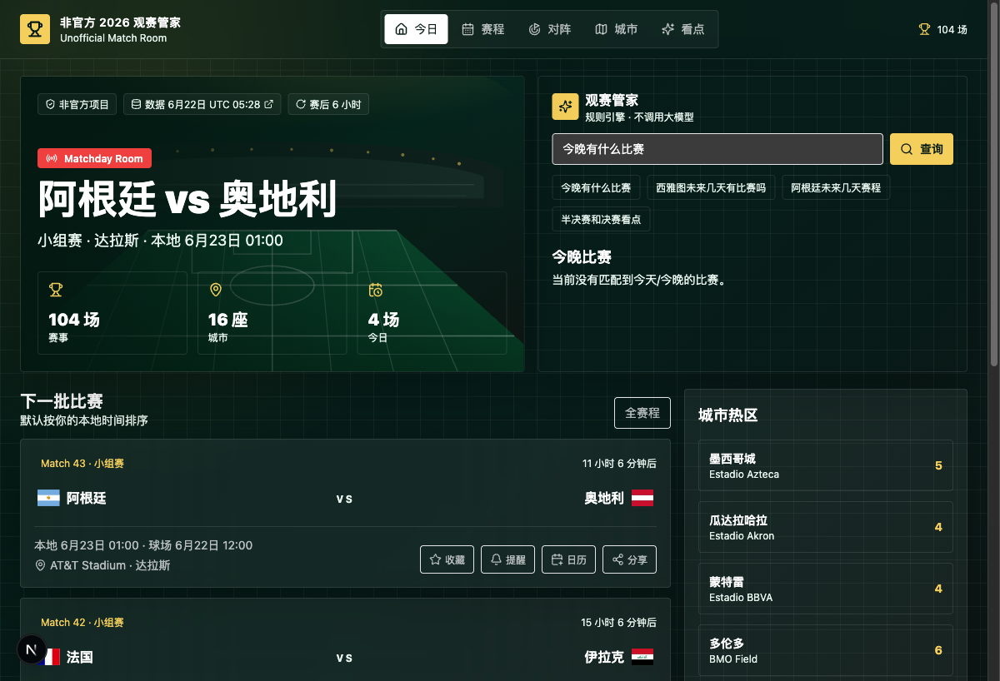

# 非官方 2026 世界杯观赛管家

Unofficial Chinese watch guide for the 2026 World Cup schedule, bracket, host cities, teams, calendar export, and rule-based viewing concierge.

> This is an unofficial fan-made project. It is not affiliated with, endorsed by, or sponsored by FIFA.


一个中文、手机优先的 2026 世界杯观赛辅助网页。它把赛程、城市、国家、对阵图、收藏提醒、日历导出和规则型“观赛管家”放在同一个体验里，适合作为非官方球迷工具或产品/前端作品集项目发布。

## Quick Links

- Live demo: 部署后填写公开地址
- Data status: `/status`
- Release notes: [docs/releases/v0.1.0.md](docs/releases/v0.1.0.md)
- Repository metadata: [docs/REPOSITORY_METADATA.md](docs/REPOSITORY_METADATA.md)
- Good first issues: [docs/GOOD_FIRST_ISSUES.md](docs/GOOD_FIRST_ISSUES.md)



## 功能

- 今日/今晚观赛：首页展示下一场比赛、下一批比赛、城市热区和数据更新时间。
- 全赛程筛选：按时间、轮次、城市、球场、国家和比赛状态过滤，并支持可分享筛选 URL。
- 对阵图：用国家国旗和名称展示小组与淘汰赛路径，未决席位保留占位。
- 城市页：查看 16 个主办城市、球场、未来比赛和本地观赛提示。
- 国家页：查看单个国家的赛程、结果、晋级路径和球员看点。
- 半决赛/决赛看点：展示核心球员、伤停/停赛、预计首发和故事线。
- 规则型观赛管家：支持“今晚有什么比赛”“西雅图未来几天有比赛吗”“阿根廷未来几天赛程”等自然语言式输入，不调用 AI 接口。
- 本地收藏、浏览器提醒、单场/筛选/全部 `.ics` 日历导出和单场比赛分享。
- 数据状态页：展示快照时间、数据来源、刷新策略、比赛统计和 `/api/status`。

## 技术栈

- Next.js 15 + React 19 + TypeScript
- Tailwind CSS
- `flag-icons` 国旗资源
- `lucide-react` 图标
- 本地 JSON 数据与抓取脚本

## 快速开始

```bash
npm install
npm run dev
```

打开 `http://localhost:3000`。

## 常用命令

```bash
npm run refresh:data   # 从公开来源刷新赛程和比分快照
npm run test:data      # 检查赛程、城市、淘汰赛和数据完整性
npm run typecheck      # TypeScript 检查
npm run lint           # 代码检查
npm run build          # 生产构建
npm run check:release  # 发布前完整检查
```

## 数据更新

当前数据快照来自 `src/data/worldcup.generated.json`，最近生成时间为 `2026-06-22T05:28:16.828Z`，包含 104 场比赛，其中 40 场已完赛、64 场待赛。

数据刷新策略：

- 优先从公开赛程/比分页面抓取并解析结构化数据。
- `src/data/manual-overrides.json` 可用于人工覆盖比分或未决席位。
- `src/data/match-number-map.json` 用于稳定已完赛比赛编号。
- GitHub Actions 中的 `Data Refresh` 工作流会在 2026-06-11 到 2026-07-20 之间每 6 小时尝试刷新数据并提交变更。
- 本项目不承诺分钟级直播比分，适合赛后周期更新。

## API

- `GET /api/matches`：比赛列表，支持 `dateRange`、`city`、`team`、`round`、`status`。
- `GET /api/bracket`：小组排名、淘汰赛路径和未决席位。
- `GET /api/venues`：主办城市、球场、时区和未来比赛。
- `GET /api/teams/[code]`：国家队赛程、结果和看点。
- `GET /api/concierge?q=`：规则型观赛管家。
- `GET /api/status`：数据快照、比赛统计、下一场比赛和刷新策略。
- `POST /api/refresh`：触发本地数据刷新脚本。

## GitHub Launch

发布到 GitHub 后，建议立即完成：

- 在 About 区填写公开 Demo、描述和 topics，参考 [docs/REPOSITORY_METADATA.md](docs/REPOSITORY_METADATA.md)。
- 上传 `docs/social-preview.png` 作为 Social Preview。
- 创建 `v0.1.0` Release，内容可直接使用 [docs/releases/v0.1.0.md](docs/releases/v0.1.0.md)。
- 把 `Live demo` 链接替换成真实部署地址。

## 发布说明

- 这是非官方项目，不使用 FIFA 官方标识、吉祥物、海报或商业素材。
- 赛程、比分和球队信息需要以数据来源的许可与使用条款为准。
- 发布到 GitHub 前请确认仓库描述中包含 `unofficial` 或 `非官方`。
- 推荐部署到 Vercel、Netlify 或任何支持 Next.js 的平台。

## 许可

代码使用 MIT License。赛程数据、国旗图标、远程图片和其他第三方内容遵循各自来源的许可与使用条款，详见 [DATA_SOURCES.md](DATA_SOURCES.md)。
